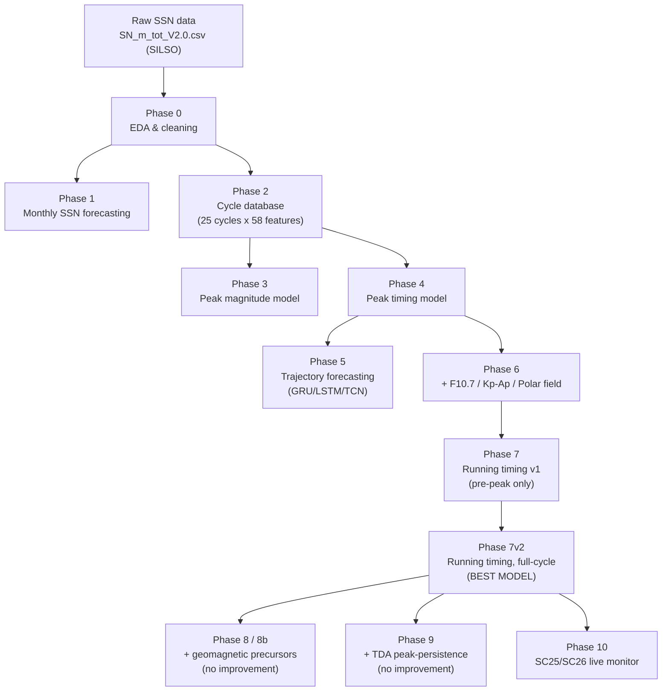
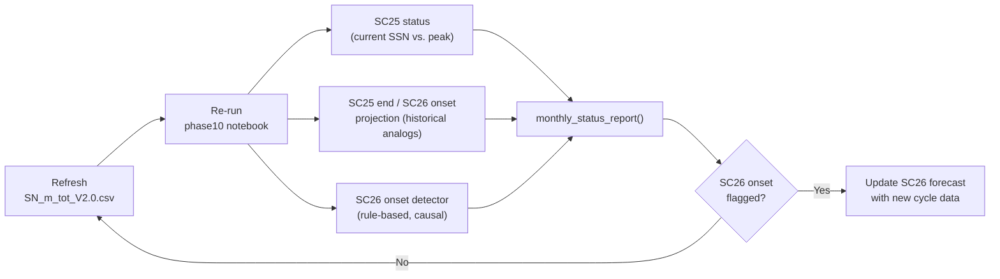

# Solar Cycle Peak Forecasting

A machine learning project that forecasts the **magnitude, timing, and trajectory of solar cycle peaks** using sunspot number (SSN) data, and provides a live monitoring tool for tracking Solar Cycle 25 (SC25) toward its end and the onset of Solar Cycle 26 (SC26).

For full results, methodology, and conclusions for every phase, see **[`Solar_Cycle_Forecasting_Progress_Report.md`](Solar_Cycle_Forecasting_Progress_Report.md)**. The original scope is in [`Solar_Cycle_Peak_Forecasting_Project_Plan (1).md`](<Solar_Cycle_Peak_Forecasting_Project_Plan (1).md>).

## Contents

- [Project status](#project-status)
- [Requirements](#requirements)
- [Pipeline overview](#pipeline-overview)
- [Repository structure](#repository-structure)
- [Why 13-month smoothing?](#why-13-month-smoothing)
- [Live monitoring (Phase 10)](#live-monitoring-phase-10)
- [Key takeaways](#key-takeaways)
- [Data sources](#data-sources)
- [License](#license)

## Project status

**Phases 0–10 complete.** All models use leakage-free Leave-One-Cycle-Out (LOCO) cross-validation across the 24 completed solar cycles (SC1–SC24), with SC25 as the live forecast target.

**Headline results:**

- Peak timing (Phase 4): MAE = 5.96 months, R² = 0.677
- Peak magnitude (Phase 3): R² = 0.757
- Additional datasets (Phase 6, F10.7/Kp-Ap/Polar field): timing MAE improved to 5.11m (−14%)
- Running timing forecast (Phase 7 v2 — **best model**): overall MAE = 4.39m, post-peak sign accuracy = 95.4%
- Geomagnetic precursors (Phase 8/8b) and TDA peak-persistence features (Phase 9): tested as feature additions to Phase 7 v2 — **neither improved performance** (small-N=24 ceiling)
- SC25 actual peak: smoothed SSN = 159.2, April 2025
- Live monitoring (Phase 10): as of May 2026, SC25 is at 66.2% of its peak and declining; projected SC26 onset window ≈ **Sep 2030 – Mar 2033**

## Requirements

This project uses standard Python data-science and ML libraries. Install them with:

```bash
pip install -r requirements.txt
```

`requirements.txt` includes:

- `numpy`, `pandas` — data handling
- `matplotlib` — plots
- `scikit-learn` — Ridge, Random Forest, scaling, metrics
- `xgboost` — gradient-boosted trees (Phase 1)
- `torch` — GRU/LSTM/TCN trajectory models (Phase 5)
- `jupyter` — to run the notebooks

All notebooks were built and run with Python 3.10.

## Pipeline overview



**Phase 10 monthly monitoring loop:**



## Repository structure

```
data/                                  Raw and processed datasets (SSN, cycle database, geomagnetic/polar precursors)
phase0/   phase0_eda.ipynb             Data acquisition, cleaning, exploratory analysis
phase1/   phase1_forecasting.ipynb     Monthly SSN forecasting (baselines + tree models)
phase2/   phase2_cycle_database.ipynb  Cycle database construction (25 cycles x 58 features)
phase3/   phase3_peak_magnitude.ipynb  Peak magnitude prediction (LOCO CV)
phase4/   phase4_peak_timing.ipynb     Peak timing prediction (LOCO CV)
phase5/   phase5_trajectory_forecasting.ipynb   Trajectory forecasting (GRU/LSTM/TCN)
phase6/   phase6_additional_datasets.ipynb      F10.7 + Kp/Ap + Polar field features
phase7/   phase7_dynamic_timing.ipynb           Running timing forecast, v1 (pre-peak only)
phase7v2/ phase7v2_fullcycle_timing.ipynb       Running timing forecast, v2 (full-cycle) — best model
phase8/   phase8_precursor_dataset.ipynb        Geomagnetic (aa) + polar field precursor dataset
phase8b/  phase8b_precursor_augmented_models.ipynb  Precursor-augmented model comparison
phase9/   phase9_tda_features.ipynb             Topological (peak-persistence) feature extraction & test
phase10/  phase10_sc25_sc26_monitor.ipynb        SC25/SC26 live monitoring tool
```

Each phase folder contains its notebook plus `plots/` (and `results/` where applicable) generated by that notebook.

## Why 13-month smoothing?

Raw monthly sunspot numbers are noisy — they can swing by tens of points from one month to the next even while the sun's underlying activity is rising or falling smoothly. To see the true shape of a solar cycle (and to reliably identify its peak), this project follows the long-standing convention used by solar physicists worldwide: averaging sunspot counts over a **13-month window**.

**Why 13 and not some other number?**

- **12 months (1 year)** averages out any leftover seasonal/annual artifacts in the data.
- **The extra (+1) month** makes the window an odd number, so the average can be centered on a single specific month rather than falling between two months.
- This 13-month "smoothed sunspot number" is the **official SILSO/international standard** for defining solar cycle minima, maxima, and overall shape — it has been used consistently for over a century, which lets SC25 be compared fairly against all 24 previous cycles (SC1–SC24) measured the same way.

**Two flavors used in this project:**

- **Centered smoothing** (used in Phases 0–9): averages 6 months before and 6 months after a given month — best for retrospective analysis once future data is available, since it places the peak at the true center of the high-activity window.
- **Trailing/causal smoothing** (used in Phase 7 v2's running model and Phase 10's live monitor): averages only the 13 months *up to and including* the current month — necessary for live forecasting, since future months don't exist yet.

Both produce the same smoothed values for the same underlying data — they just label the peak with different month names (see the note in the progress report's Phase 10 section for the SC25 example: October 2024 vs. April 2025, same peak value of 159.2).

**Scientific significance:** without this smoothing, "peak detection" would be at the mercy of random monthly noise — a single unusually active or quiet month could shift the apparent peak by months and throw off both magnitude and timing estimates. The 13-month smooth is what makes it possible to define a cycle's peak, rise time, and decay time consistently enough to train models and compare cycles against each other at all.

## Live monitoring (Phase 10)

`phase10/phase10_sc25_sc26_monitor.ipynb` is a lightweight, **re-runnable** notebook — no retraining required for its core cells. To get an updated status:

1. Refresh `data/SN_m_tot_V2.0.csv` with the latest SILSO monthly sunspot data.
2. Re-run the notebook (or just the `monthly_status_report()` cell) for an updated:
   - SC25 status (current SSN vs. peak, % of peak, trend)
   - Projected SC25 end / SC26 onset window (from SC1–24 historical analogs)
   - SC26 onset detector flag (rule-based, causal)

## Key takeaways

- **Phase 7 v2 remains the best-known running model** — full-cycle training with causal trailing-smoothed features and a signed target.
- **Additional features (geomagnetic precursors, TDA peak-persistence) did not improve LOCO CV performance** — strong evidence of a small-N (24 cycles) ceiling for tabular SSN-derived features.
- **SC25 has peaked (Apr 2025, SSN 159.2) and is in decline.** SC26 onset is not yet flagged; current projections put it in the early 2030s.

## Data sources

- SILSO Version 2.0 Monthly Sunspot Number (Royal Observatory of Belgium), Jan 1749–present
- Geomagnetic aa index (1900–2024)
- F10.7 solar radio flux, Kp/Ap geomagnetic indices, solar polar field strength

## License

This project's code and documentation are licensed under the [MIT License](LICENSE). Note that the underlying SILSO sunspot data and other third-party datasets retain their own usage terms — see [Data sources](#data-sources).
